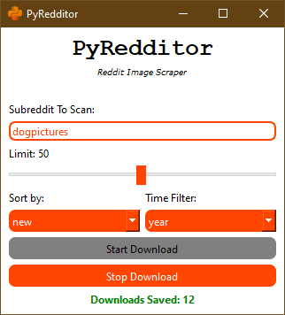

# PyRedditor 0.4
Download images from a subreddit. You can choose how many posts to scan, filter according to time, and how to sort.

## Screen shots

##
## Important: 

**In order to use the script, you need to use your own credentials.** See this page for simple, quick instructions:

https://www.reddit.com/prefs/apps
##

Example:

    {"client_id": "YOUR_CLIENT_ID", "client_secret": "YOUR_CLIENT_SECRET", "password": "YOUR_ACCOUNT_PASSWORD", "username": "YOUR_ACCOUNT_USERNAME", "user_agent": "YOUR_USER_AGENT"}

##    
Images will be downloaded into "images" folder, and then with the subreddit's name. The images folder is inside the folder where the script is running.

#### Dependencies:
1. praw
2. requests
3. pyside6

`pip install .`

## Versions
There are two versions:

`pyredditor.pyw`: used to scrape subreddits loaded from a text file

`pyredditor_single.pyw`: used to scrape one subreddit

## License: MIT

##### Notes:
I don't know who wrote the original cli code, I found it on the Internet somewhere. It's the basis for the GUI version by me. Thanks to the original author(s).
